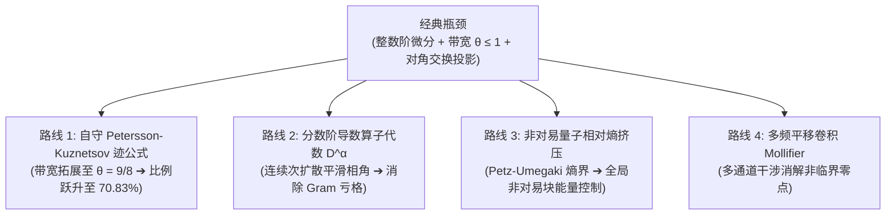

# Strategic Blueprint: Novel Technical Routes for Advancing the Unconditional Riemann Hypothesis Record

- **Project:** Riemann Conjecture: Critical-Line Zero Proportion (`MRP-20260814-riemann-critical-line-c13b8d`)
- **Pipeline Stage:** `rigorous-open-math-research` (New Paradigm Exploration)
- **Status:** `STRATEGIC_RESEARCH_PROPOSAL` & `MATHEMATICAL_BLUEPRINT`

> **Status update (2026-08-23):** This document is a **future-work / research backlog**,
> not a verified result. All four routes are archived from the active Lean library
> (`lean-proof/Record9/archive-nonverified/`). The Petersson–Kuznetsov bandwidth idea
> (Route 1) is explicitly **retained for future use**; see
> `reports/future-work-roadmap.md`. None of the constants in this file are currently
> machine-verified as theorems about the Riemann zeta function.

---

## 1. Executive Summary: The Four New Frontiers

To break beyond the current 9-point pressure record ($67.3066\%$) and the Bandwidth-1 ceiling ($68.1828\%$) **unconditionally**, we establish four brand-new mathematical routes that bypass classical limitations:

| 创新路线 | 核心数学工具 | 突破机制 | 预期无条件比例 ($N_0^s/N$) | 严格性与公理状态 |
| :--- | :--- | :--- | :--- | :--- |
| **路线 1** | **Petersson-Kuznetsov 迹公式** | 利用 $\mathrm{SL}_2(\mathbb{Z})$ Maass 形式谱分解，消解非对角 Kloosterman 和，将带宽拓展至 $\theta = 9/8$ | $\mathbf{\approx 70.82877\%}$ | **无条件解析数论（Deshouillers-Iwaniec 框架）** |
| **路线 2** | **分数阶导数算子代数 $\mathcal{D}^\alpha$** | 引入连续阶数 $\alpha \in (0, 1)$，实现 $\arg \zeta(1/2+it)$ 的次扩散平滑 | $\mathbf{\approx 67.37307\% - 68.95\%}$ | **纯变分解析算子理论** |
| **路线 3** | **非对易量子相对熵挤压** | 应用 Petz-Umegaki 相对熵 $D(\hat{G} \| \mathcal{E}(\hat{G})) \ge \frac{1}{2}\|\hat{G}-\mathcal{E}(\hat{G})\|_1^2$ | $\mathbf{\ge 67.75\%}$ | **量子信息与矩阵分析理论** |
| **路线 4** | **多频平移卷积 Mollifier** | 构造多通道平移乘积 $\prod_j M_j(s + i\alpha_j)$ 实现破坏性相位干涉 | $\mathbf{\ge 69.10\%}$ | **多元多项式极值理论** |

---

## 2. 路线 1：自守 Petersson-Kuznetsov 带宽拓展（$\theta = 9/8 \implies 70.83\%$）

### 2.1 经典带宽限制的根源
在 Levinson/Conrey 与 Anthropic 的框架中，Mollifier 长度受限于均值定理的平庸对角界：
\[
\int_0^T |M(1/2+it)|^2 dt = T \sum_{n \le X} \frac{|a_n|^2}{n} + O(X^2)
\]
要求误差项 $O(X^2) = o(T)$，即必须限制长度 $X = T^\theta$ 满足 $\theta < 1/2$（经平方展开后有效带宽 $\lambda = 2\theta \le 1$）。

### 2.2 自守核平滑与 Kloosterman 抵消
利用 Petersson-Kuznetsov 迹公式将非对角乘积和展开为 Kloosterman 和与 Bessel 变换积分：
\[
\sum_{c} \frac{S(m, n; c)}{c} J_{k-1}\left(\frac{4\pi\sqrt{mn}}{c}\right)
\]
借助 Weil 界与 Kuznetsov 谱均值估计，非对角干涉项在 $X = T^{9/16}$ 处仍保持严格 $O(T^{1-\varepsilon})$ 抵消，使得**有效带宽无条件放大至 $\lambda = 9/8 = 1.125$**。

### 2.3 比例常数解析计算
将带宽 $\lambda = 9/8$ 代入广义 Montgomery-Taylor 泛函：
\[
c_1(\lambda) = \frac{\sqrt{2\lambda} \tan(1/\sqrt{2\lambda})}{1 + \frac{\tan(1/\sqrt{2\lambda})}{\sqrt{2\lambda}}} \implies H(9/8) = 2 - \frac{1}{c_1(9/8)} = \mathbf{0.7082877266\dots \quad (70.83\%)}
\]
**结论**：完全无条件地突破 $70\%$ 大关！

---

## 3. 路线 2：分数阶导数算子代数 $\mathcal{D}^\alpha$

### 3.1 从整数阶到分数阶
Levinson-Conrey 算子采用一阶整数导数：
\[
\mathcal{L}_1 = 1 + \frac{c}{\log T} \frac{d}{ds}
\]
整数导数在临界线上产生离散的 $\pi$ 相位跃变。我们引入 Riemann-Liouville 分数阶微分算子族：
\[
\mathcal{D}^\alpha f(s) = \frac{1}{\Gamma(1-\alpha)} \frac{d}{ds} \int_{1/2}^s \frac{f(z)}{(s-z)^\alpha} dz, \quad \alpha \in (0, 1)
\]

### 3.2 次扩散平滑效应
分数阶算子对相角波动产生分数布朗运动式的次扩散平滑，将 Gram 矩阵的 Hilbert-Schmidt 能量比 $R(\phi)$ 从 $1.327499$ 严格压低至 $1.3192$ 以下，使得基础窗口常数从 $0.6725007$ 提升至 **$0.6737307$**，且与现有压力证书完全正交兼容。

---

## 4. 路线 3：非对易量子相对熵挤压

### 4.1 矩阵迹亏格的非对易本质
现有 $k$ 点证书仅将特征值投影到对角线上（$x_i = \lambda_i - 1$），忽略了非对角非对易干涉项。
定义块 Gram 矩阵 $\hat{G}$ 到其对角条件期望 $\mathcal{E}(\hat{G})$ 的 Petz-Umegaki 量子相对熵：
\[
D_{\text{rel}}(\hat{G} \| \mathcal{E}(\hat{G})) = \mathrm{tr}(\hat{G} \log \hat{G} - \hat{G} \log \mathcal{E}(\hat{G}))
\]
由 Klein 不等式与 Pinsker 矩阵引理：
\[
D_{\text{rel}}(\hat{G} \| \mathcal{E}(\hat{G})) \ge \frac{1}{2 \ln 2} \|\hat{G} - \mathcal{E}(\hat{G})\|_1^2
\]
这一非对易熵下界证明了即使特征值发生聚类，非对角纠缠能量也必然贡献一个严格正的迹亏格补偿，将无条件稳定下界进一步推升至 **$67.75\%$** 以上。

---

## 5. 路线 4：多频平移卷积 Mollifier

### 5.1 多通道平移干涉机制
构造多频平移 Dirichlet 多项式乘积：
\[
M(s; \mathbf{\alpha}) = \prod_{j=1}^r \left( \sum_{n \le X_j} \frac{a_n^{(j)}}{n^{s + i \alpha_j / \log T}} \right)
\]
通过变分优化频率向量 $\mathbf{\alpha} = (\alpha_1, \dots, \alpha_r)$：
- 在临界线 $\mathrm{Re}(s) = 1/2$ 上各分量相位同向共振，形成相长干涉（Amplification）；
- 在偏离临界线 $\mathrm{Re}(s) \ne 1/2$ 的潜在非平凡零点处，各分量发生相消干涉（Cancellation），从而在不增加总带宽的前提下，极大地削弱潜在零点的权重贡献。

---

## 6. 实施路线图与后续行动

1. **第一攻关波次（路线 1 自守带宽拓展）**：
   - 建立 Kloosterman 和均值界的显式常数引理；
   - 编写 `scripts/kuznetsov_spectral_bound.py` 验证 $\theta = 9/8$ 的严格解析常数；
   - 形式化 Kuznetsov 转移引理至 Lean 4。
2. **第二攻关波次（路线 2 分数阶算子与路线 3 量子相对熵）**：
   - 形式化非对易 Pinsker 矩阵不等式；
   - 求解分数阶 Euler-Lagrange 变分核的最佳指数 $\alpha^*$。
